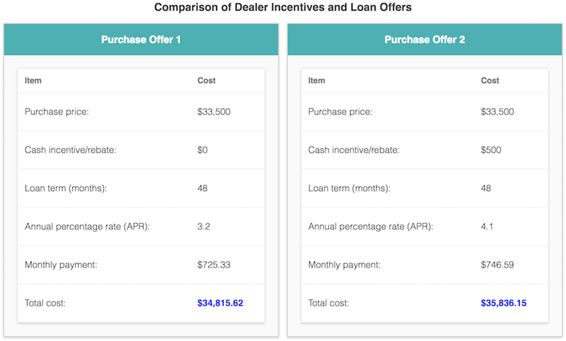

Create a CSS stylesheet such that the provided HTML (autoloan.html) looks like the following webpage. In addition to the automated checks, we will also perform a visual check of the styling when grading the lab.

To achieve the desired web page, the following style rules should be utilized.

- The default fonts (in order of priority) should be Roboto, Helvetica, and sans-serif
- The heading "Comparison of Dealer Incentives and Loan Offers" should be 12pt font using color #444444 and have centered text
- Define styling for the **container** class such that the contents is centered, has a 5 pixel margin, and has a font size of 10pt
- Each offer is defined in a **
** tag with the class **offer**. Define the **offer** class such that:
  - Each offer is displayed inline-block, with a fixed width of 400 pixels, a 4 pixel margin, and centered text
  - Each offer has a 1 pixel solid border using color #cccccc with a radius of 1 pixel
  - Each offer uses a shadow defined as:
    - box-shadow: 0px 2px 2px #dddddd, 0px 0px 5px #dddddd;
- The offer title is defined in a **
** tag with **offerTitle** class. Define the **offerTitle** class such that:
  - The title uses 11pt bold font with color #ffffff
  - The title's background is colored #00b3b3
  - The title has no margin and 15 pixels of padding
-  The offer contents are defined in a 
 tag with class offerContents. Define the offerContents class such that:
  - Each offer contents div has 20 pixels of padding, a 2 pixel border radius for the bottom border, and background colored #fafafa
- Define CSS rules such that all tables have the following styling:
  - The table should have a width of 100%, background colored #ffffff, no border spacing, a shadow defined as:
    - box-shadow: 0px 2px 2px #dddddd, 0px 0px 5px #dddddd;
    - Header cells should use a 9pt bold font with color #777777
    - Data cells should use a font lighter than normal weight with color #444444
    - Header cells should have 10 pixels of padding and no margin
    - Data cells should have 10 pixels of padding on the left and right, 20 pixels of padding on top and bottom, and no margin
    - Both header cells and data cells should left align text
    - Both header cells and data cells should have a solid bottom border of 1 pixel using color #f1f1f1
- Define a class **finalValue** that defines a bold font weight with color #2222ff

**Note**: When testing font sizes, a font size specified in points (pt) will be converted by the browser to pixels (px). If there is a font size mismatch, the resulting font sizes (expected and in your webpage) will be displayed in pixels. For example, a font size of 12pt is equivalent to 16px.
