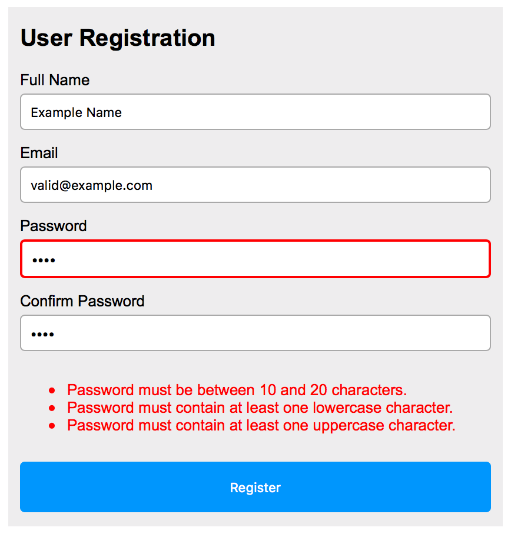

Create a webpage consisting of HTML (register.html), CSS (style.css), and JavaScript (register.js) files that implement a user registration form with form validation.

The webpage styling should be close to the following. Note: Specific styles listed in the requirements will be checked using automated tests, but a visual inspection may also be used to check the overall style of the webpage.

1. User inputs elements: Define the following \<input> elements using the specified IDs
	- Text \<input> element with ID fullName and label "Full Name"
	- Email \<input> element with ID email and label "Email"
	- Password \<input> element with ID password and label "Password"
	- Password \<input> element with ID passwordConfirm and label "Confirm Password"
	- Submit \<input> element with ID submit and value "Register"
	- The default border for the text, email, and password \<input> elements should be 1 pixel, solid, with color #aaa
	- Do not use a \<form> element. Instead, use a \
 with class form

2. \
 for errors: Create a \
 with ID formErrors that will be used to display any validation errors.
	- Initially the \
 should not be displayed (i.e., the display style should be none)

3. Form validation: Define a click event listener for the \<input> element with ID submit that verifies the user provided information is valid.
  - If there are form validation errors,
    - The formErrors 
 should be shown by setting display to block
    - Each of the associated error messages should be displayed in the formErrors 
 using an unordered list with red text. The error message must be displayed in the order the validation is performed, following the order specified below.
    - Each \<input> element with the invalid input should be styled with a 2 pixel, red, solid border.
      - Otherwise, the default border should be used (1 pixel, solid, with color #aaa)
  - If there are no form validation errors,
    - The formErrors \
 should not be shown (i.e., the display style should be none)
    - All text, email, and password \<input> elements should use the default border of 1 pixel, solid, color #aaa
  - Perform the following form validations in the order provided and display all error messages that apply
    - Ensure a full name with a length greater than or equal to 1 was provided
      - Otherwise, display "Missing full name." Ensure that an email address was provided and that the email address matches the regular expression: /^[a-zA-Z0-9._-]+@[a-zA-Z0-9.-]+\.[a-zA-Z]{2,5}$/
      - Otherwise, display "Invalid or missing email address."
    - Ensure the password has 10 to 20 characters
      - Otherwise, display "Password must be between 10 and 20 characters."
    - Ensure the password contains at least one lowercase character
      - Otherwise, display "Password must contain at least one lowercase character."
    - Ensure the password contains at least one uppercase character
      - Otherwise, display "Password must contain at least one uppercase character."
    - Ensure the password contains at least one digit
      - Otherwise, display "Password must contain at least one digit."
    - Ensure the password and confirmation password match
      - Otherwise, display "Password and confirmation password don't match."
